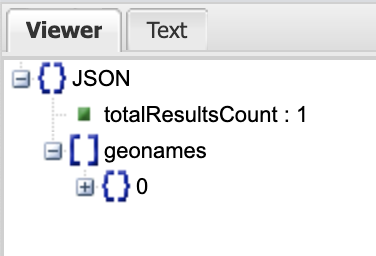

# Geocoding & Other APIs


### How to use Web APIs and OpenRefine for geocoding and augmenting data with geographic attributes. 

## Getting Ready 
First: Download the data for this exercise, here: https://drive.google.com/file/d/1CSYNAfbUZH2chaQNsCN-7WKlCCEYk93h/view?usp=sharing  

This tutorial will demonstrate how to use OpenRefine to submit URLs to web-based Geocoding APIs in order to augment an existing dataset with things like latitude & longitude coordinates, elevation values, drive times, etc...

OpenRefine is a piece of open-source software that allows you to manipulate data in many different ways. It's not just great for geocoding and augmenting datasets, but is really great for cleaning up 'dirty' data, too. 

For the needs of this tutorial, OpenRefine allows us to build and submit URLs to a web service (like a geocoding API) over and over tens, hundreds, even thousands or more times, saving us the trouble of typing a URL into a browser and copy & pasting values, one at a time. **OpenRefine** runs in your browser, but does so locally by installing itself as a sort of server running on your own machine.  OpenRefine used to be called GoogleRefine, but has recently been re-branded, so much of the support materials you will find on-line will still refer to GoogleRefine.  


You will need to download OpenRefine in order to complete this tutorial. You can get the appropriate version for your operating system from [OpenRefine.org] (http://openrefine.org/). In the meantime, there are 3 videos on the OpenRefine frontpage. You should take a look at all three, because they give a great, concise overview of many of the capabilities of OpenRefine. For the purposes of this tutorial, it wouldn't hurt to watch the 3rd video, linked here:

http://www.youtube.com/watch?feature=player_embedded&v=5tsyz3ibYzk

You might also want to take a look at this page on "___Understanding Expressions___" in OpenRefine:

https://github.com/OpenRefine/OpenRefine/wiki/Understanding-Expressions

And, here's the full Documentation Wiki:

https://github.com/OpenRefine/OpenRefine/wiki/Documentation-For-Users


## What is an [Geocoding] API?
An **API** (**Application Programming Interface**) is, essentially, a set of instructions that allows computer programs to pass data back and forth.  In the following exercises, we will be using several Web APIs.  The Web APIs we will use allow you to submit a URL just like when you type a URL into your browser address bar.  The important difference is that the URL we are submitting has a bit of data (an address or coordinate pair) that we want to know something about. Rather than giving us back an HTML file that instructs our browser to retrieve images, text and other object and arrange them into a webpage, the Web APIs we will be using give us back information about the address/coordinate pair we submitted.


# Geonames.org
##Create an Account

Since  Geo-locate has practical limits, we will use the Geonames.org geocoding services for the rest of this exercise. You'll need to create an account, but you will be able to use this account forever! As a practical matter, geonames.org is pretty performant, and I typically submit 10 records per second. The limits are very generous, too, with 1000 per hour and 20,000 per day the only real practical limits. You can look at the other API services from Geonames.org, here: https://www.geonames.org/export/ws-overview.html 


### Important: Get a geonames.org username  

https://www.geonames.org/login

*Do not use the 'demo' account for your exercise or your own geocoding. It is only meant for the sample links on the documentation pages. Create your own account instead*  

The parameter ```username``` ***needs to be passed with each request***. Once you have an username, it can be registered for API use [here](http://www.geonames.org/login): http://www.geonames.org/login. You will then receive an email with a confirmation link and after you have confirmed the email you can enable your account for the webservice on your account page

## Examine the API Docs

Geonames.org provides a number of useful APIs for querying spatial data. They probably have one of the most complete **global postal code** geocoding services available, certainly for free. You can also do reverse geocoding, find the elevation for any lat/lon, etc... Here is an overview of all of the available APIs and links to the docs for using  them. Once you've learned to use the basic geocoding API, you should be able to use the other APIs fairly easily.

http://www.geonames.org/export/ws-overview.html

## Building your template Query
I always start by building a single URL query to quickly test that  I have typed  all of my parameters correctly and that Geonames.org is returning valid data. 

We're interested in the ___Search___ API

http://www.geonames.org/export/geonames-search.html


1. Go to http://www.geonames.org/advanced-search.html?

2. Search for 'Bexar County, Texas'; Country='United States'; Feature Class='Country,State,Region...'


The resulting URL in the Browser Address Bar should look like this:

```
http://www.geonames.org/advanced-search.html?q=Bexar+County%2C+Texas&country=US&featureClass=A&continentCode=
```

## Creating the API Query URL
Now you need to change the server that your URL is using. This is because anonymous queries  are only allowed from the www.geonames.org page, one at a time. To query in bulk, we will need to submit to the API server

3. Open up a Text Editor of your choice and Cut&Paste the part of the URL from the 'q=' parameter, all the way to the end of the URL, like this:

```
q=Bexar+County%2C+Texas&country=US&featureClass=A&continentCode=
```

4. Paste the API Base URL in front of the URL part you just pasted into your browser:

Here is the Base URL of the Geonames.org Search API:

```
api.geonames.org/search?
```

Here is what it should look like after pasting the two together:

```
api.geonames.org/search?q=Bexar+County%2C+Texas&country=US&featureClass=A&continentCode=
```
## Testing your API query URL  

5. Cut&Paste this new URL into your browser and hit enter to submit the URL. 

What you will get is an XML file, with an error message:  

```This XML file does not appear to have any style information associated with it. The document tree is shown below.
<geonames>
<status message="Please add a username to each call in order for geonames to be able to identify the calling application and count the credits usage." value="10"/>
</geonames>```  


## Add your Username to the query

To use the API, you are required to identify yourself each time you submit a query. Now, you need to add a parameter that identifies you. You will add the username parameter, using your own username that you created when you registered with Geonames.org:

The parameter is:  

```url
&username=?????????
```
Where you will replace the **????????** with your ***Geonames.org Username*** that you registered, earlier. Just put this right on the end of the URL you are building:  

```
api.geonames.org/search?q=Bexar+County%2C+Texas&country=US&featureClass=A&continentCode=&username=yourgeonamesusername
```  

Now try hitting enter to submit the URL, again. You should see something like the below (it's a large amount of text, since we haven't limited the returns, yet):

```XML
This XML file does not appear to have any style information associated with it. The document tree is shown below.
<geonames style="MEDIUM">
<totalResultsCount>14</totalResultsCount>
<geoname>
<toponymName>Bexar County</toponymName>
<name>Bexar County</name>
<lat>29.44896</lat>
<lng>-98.52002</lng>
<geonameId>4674023</geonameId>
<countryCode>US</countryCode>
<countryName>United States</countryName>
<fcl>A</fcl>
<fcode>ADM2</fcode>
</geoname>
<geoname>
<toponymName>City of Elmendorf</toponymName>
<name>City of Elmendorf</name>
<lat>29.25547</lat>
<lng>-98.31695</lng>
<geonameId>7173379</geonameId>
<countryCode>US</countryCode>
<countryName>United States</countryName>
<fcl>A</fcl>
<fcode>ADMD</fcode>
</geoname>
<geoname>
<toponymName>City of Helotes</toponymName>
<name>City of Helotes</name>
<lat>29.56325</lat>
<lng>-98.70832</lng>
<geonameId>7173601</geonameId>
<countryCode>US</countryCode>
<countryName>United States</countryName>
<fcl>A</fcl>
<fcode>ADMD</fcode>
</geoname>
<geoname>
<toponymName>City of Selma</toponymName>
<name>City of Selma</name>
<lat>29.58652</lat>
<lng>-98.31338</lng>
<geonameId>7174414</geonameId>
<countryCode>US</countryCode>
<countryName>United States</countryName>
<fcl>A</fcl>
<fcode>ADMD</fcode>
</geoname>
<geoname>
<toponymName>City of Somerset</toponymName>
<name>City of Somerset</name>
<lat>29.22848</lat>
<lng>-98.65671</lng>
<geonameId>7174465</geonameId>
<countryCode>US</countryCode>
<countryName>United States</countryName>
<fcl>A</fcl>
<fcode>ADMD</fcode>
</geoname>
<geoname>
<toponymName>City of Von Ormy</toponymName>
<name>City of Von Ormy</name>
<lat>29.28019</lat>
<lng>-98.65567</lng>
<geonameId>7226947</geonameId>
<countryCode>US</countryCode>
<countryName>United States</countryName>
<fcl>A</fcl>
<fcode>ADMD</fcode>
</geoname>
<geoname>
<toponymName>City of Castle Hills</toponymName>
<name>City of Castle Hills</name>
<lat>29.52284</lat>
<lng>-98.51971</lng>
<geonameId>7172817</geonameId>
<countryCode>US</countryCode>
<countryName>United States</countryName>
<fcl>A</fcl>
<fcode>ADMD</fcode>
</geoname>
<geoname>
<toponymName>City of Grey Forest</toponymName>
<name>City of Grey Forest</name>
<lat>29.61693</lat>
<lng>-98.68332</lng>
<geonameId>7173551</geonameId>
<countryCode>US</countryCode>
<countryName>United States</countryName>
<fcl>A</fcl>
<fcode>ADMD</fcode>
</geoname>
<geoname>
<toponymName>City of Hill Country Village</toponymName>
<name>City of Hill Country Village</name>
<lat>29.58311</lat>
<lng>-98.48913</lng>
<geonameId>7173621</geonameId>
<countryCode>US</countryCode>
<countryName>United States</countryName>
<fcl>A</fcl>
<fcode>ADMD</fcode>
</geoname>
<geoname>
<toponymName>City of Leon Valley</toponymName>
<name>City of Leon Valley</name>
<lat>29.49534</lat>
<lng>-98.614</lng>
<geonameId>7173662</geonameId>
<countryCode>US</countryCode>
<countryName>United States</countryName>
<fcl>A</fcl>
<fcode>ADMD</fcode>
</geoname>
<geoname>
<toponymName>City of Shavano Park</toponymName>
<name>City of Shavano Park</name>
<lat>29.58617</lat>
<lng>-98.55632</lng>
<geonameId>7174427</geonameId>
<countryCode>US</countryCode>
<countryName>United States</countryName>
<fcl>A</fcl>
<fcode>ADMD</fcode>
</geoname>
<geoname>
<toponymName>Town of Saint Hedwig</toponymName>
<name>Town of Saint Hedwig</name>
<lat>29.41971</lat>
<lng>-98.20471</lng>
<geonameId>7175009</geonameId>
<countryCode>US</countryCode>
<countryName>United States</countryName>
<fcl>A</fcl>
<fcode>ADMD</fcode>
</geoname>
<geoname>
<toponymName>Town of Hollywood Park</toponymName>
<name>Town of Hollywood Park</name>
<lat>29.59954</lat>
<lng>-98.48391</lng>
<geonameId>7175181</geonameId>
<countryCode>US</countryCode>
<countryName>United States</countryName>
<fcl>A</fcl>
<fcode>ADMD</fcode>
</geoname>
<geoname>
<toponymName>Town of China Grove</toponymName>
<name>Town of China Grove</name>
<lat>29.39303</lat>
<lng>-98.34435</lng>
<geonameId>7175602</geonameId>
<countryCode>US</countryCode>
<countryName>United States</countryName>
<fcl>A</fcl>
<fcode>ADMD</fcode>
</geoname>
</geonames>
```

Now we will add the last two parameters to the URL and see what the result looks like. 

## Asking for JSON format

First, we want to return JSON, instead of XML, so let's add the parameter 'JSON' just between the 'search' and '?' in the URL, so our URL looks like this:
```
http://api.geonames.org/searchJSON?q=Bexar+County%2C+Texas&country=US&featureClass=A&continentCode=&username=yourusername
```

Hit enter and notice that returned format has changed (also note that I have formatted the following for easier viewing and that the JSON you get back might not have line breaks and indents):

```JSON
{
  "totalResultsCount": 14,
  "geonames": [
    {
      "adminCode1": "TX",
      "lng": "-98.52002",
      "geonameId": 4674023,
      "toponymName": "Bexar County",
      "countryId": "6252001",
      "fcl": "A",
      "population": 1714773,
      "countryCode": "US",
      "name": "Bexar County",
      "fclName": "country, state, region,...",
      "countryName": "United States",
      "fcodeName": "second-order administrative division",
      "adminName1": "Texas",
      "lat": "29.44896",
      "fcode": "ADM2"
    },
    {
      "adminCode1": "TX",
      "lng": "-98.31695",
      "geonameId": 7173379,
      "toponymName": "City of Elmendorf",
      "countryId": "6252001",
      "fcl": "A",
      "population": 1488,
      "countryCode": "US",
      "name": "City of Elmendorf",
      "fclName": "country, state, region,...",
      "countryName": "United States",
      "fcodeName": "administrative division",
      "adminName1": "Texas",
      "lat": "29.25547",
      "fcode": "ADMD"
    },
    {
      "adminCode1": "TX",
      "lng": "-98.70832",
      "geonameId": 7173601,
      "toponymName": "City of Helotes",
      "countryId": "6252001",
      "fcl": "A",
      "population": 7341,
      "countryCode": "US",
      "name": "City of Helotes",
      "fclName": "country, state, region,...",
      "countryName": "United States",
      "fcodeName": "administrative division",
      "adminName1": "Texas",
      "lat": "29.56325",
      "fcode": "ADMD"
    },
    {
      "adminCode1": "TX",
      "lng": "-98.31338",
      "geonameId": 7174414,
      "toponymName": "City of Selma",
      "countryId": "6252001",
      "fcl": "A",
      "population": 5540,
      "countryCode": "US",
      "name": "City of Selma",
      "fclName": "country, state, region,...",
      "countryName": "United States",
      "fcodeName": "administrative division",
      "adminName1": "Texas",
      "lat": "29.58652",
      "fcode": "ADMD"
    },
    {
      "adminCode1": "TX",
      "lng": "-98.65671",
      "geonameId": 7174465,
      "toponymName": "City of Somerset",
      "countryId": "6252001",
      "fcl": "A",
      "population": 1631,
      "countryCode": "US",
      "name": "City of Somerset",
      "fclName": "country, state, region,...",
      "countryName": "United States",
      "fcodeName": "administrative division",
      "adminName1": "Texas",
      "lat": "29.22848",
      "fcode": "ADMD"
    },
    {
      "adminCode1": "TX",
      "lng": "-98.65567",
      "geonameId": 7226947,
      "toponymName": "City of Von Ormy",
      "countryId": "6252001",
      "fcl": "A",
      "population": 1085,
      "countryCode": "US",
      "name": "City of Von Ormy",
      "fclName": "country, state, region,...",
      "countryName": "United States",
      "fcodeName": "administrative division",
      "adminName1": "Texas",
      "lat": "29.28019",
      "fcode": "ADMD"
    },
    {
      "adminCode1": "TX",
      "lng": "-98.51971",
      "geonameId": 7172817,
      "toponymName": "City of Castle Hills",
      "countryId": "6252001",
      "fcl": "A",
      "population": 4116,
      "countryCode": "US",
      "name": "City of Castle Hills",
      "fclName": "country, state, region,...",
      "countryName": "United States",
      "fcodeName": "administrative division",
      "adminName1": "Texas",
      "lat": "29.52284",
      "fcode": "ADMD"
    },
    {
      "adminCode1": "TX",
      "lng": "-98.68332",
      "geonameId": 7173551,
      "toponymName": "City of Grey Forest",
      "countryId": "6252001",
      "fcl": "A",
      "population": 483,
      "countryCode": "US",
      "name": "City of Grey Forest",
      "fclName": "country, state, region,...",
      "countryName": "United States",
      "fcodeName": "administrative division",
      "adminName1": "Texas",
      "lat": "29.61693",
      "fcode": "ADMD"
    },
    {
      "adminCode1": "TX",
      "lng": "-98.48913",
      "geonameId": 7173621,
      "toponymName": "City of Hill Country Village",
      "countryId": "6252001",
      "fcl": "A",
      "population": 985,
      "countryCode": "US",
      "name": "City of Hill Country Village",
      "fclName": "country, state, region,...",
      "countryName": "United States",
      "fcodeName": "administrative division",
      "adminName1": "Texas",
      "lat": "29.58311",
      "fcode": "ADMD"
    },
    {
      "adminCode1": "TX",
      "lng": "-98.614",
      "geonameId": 7173662,
      "toponymName": "City of Leon Valley",
      "countryId": "6252001",
      "fcl": "A",
      "population": 10151,
      "countryCode": "US",
      "name": "City of Leon Valley",
      "fclName": "country, state, region,...",
      "countryName": "United States",
      "fcodeName": "administrative division",
      "adminName1": "Texas",
      "lat": "29.49534",
      "fcode": "ADMD"
    },
    {
      "adminCode1": "TX",
      "lng": "-98.55632",
      "geonameId": 7174427,
      "toponymName": "City of Shavano Park",
      "countryId": "6252001",
      "fcl": "A",
      "population": 3035,
      "countryCode": "US",
      "name": "City of Shavano Park",
      "fclName": "country, state, region,...",
      "countryName": "United States",
      "fcodeName": "administrative division",
      "adminName1": "Texas",
      "lat": "29.58617",
      "fcode": "ADMD"
    },
    {
      "adminCode1": "TX",
      "lng": "-98.20471",
      "geonameId": 7175009,
      "toponymName": "Town of Saint Hedwig",
      "countryId": "6252001",
      "fcl": "A",
      "population": 2094,
      "countryCode": "US",
      "name": "Town of Saint Hedwig",
      "fclName": "country, state, region,...",
      "countryName": "United States",
      "fcodeName": "administrative division",
      "adminName1": "Texas",
      "lat": "29.41971",
      "fcode": "ADMD"
    },
    {
      "adminCode1": "TX",
      "lng": "-98.48391",
      "geonameId": 7175181,
      "toponymName": "Town of Hollywood Park",
      "countryId": "6252001",
      "fcl": "A",
      "population": 3062,
      "countryCode": "US",
      "name": "Town of Hollywood Park",
      "fclName": "country, state, region,...",
      "countryName": "United States",
      "fcodeName": "administrative division",
      "adminName1": "Texas",
      "lat": "29.59954",
      "fcode": "ADMD"
    },
    {
      "adminCode1": "TX",
      "lng": "-98.34435",
      "geonameId": 7175602,
      "toponymName": "Town of China Grove",
      "countryId": "6252001",
      "fcl": "A",
      "population": 1179,
      "countryCode": "US",
      "name": "Town of China Grove",
      "fclName": "country, state, region,...",
      "countryName": "United States",
      "fcodeName": "administrative division",
      "adminName1": "Texas",
      "lat": "29.39303",
      "fcode": "ADMD"
    }
  ]
}
```

## Limiting the type and number of returns
Finally, let's use the **&maxRows=1** parameter to tell Geonames to only return a single row of information, and the **&featureCode=ADM2** parameter (we only want County Names, returned)

1. Cut&Paste the following to the end of your API query URL

```
&maxRows=1&featureCode=ADM2
```

So that it looks like this:

```
http://api.geonames.org/searchJSON?q=Bexar+County%2C+Texas&country=US&featureClass=A&continentCode=&username=yourusername&maxRows=1&featureCode=ADM2
```

2. Hit enter to test the URL and you should return the following (again, unformatted):

```JSON
{
  "totalResultsCount": 1,
  "geonames": [
    {
      "countryId": "6252001",
      "adminCode1": "TX",
      "countryName": "United States",
      "fclName": "country, state, region,...",
      "countryCode": "US",
      "lng": "-98.52002",
      "fcodeName": "second-order administrative division",
      "toponymName": "Bexar County",
      "fcl": "A",
      "name": "Bexar County",
      "fcode": "ADM2",
      "geonameId": 4674023,
      "lat": "29.44896",
      "adminName1": "Texas",
      "population": 1714773
    }
  ]
}
```

##  What is JSON?
For our purposes, we don't really need to go deeply into what JSON (JavaScript Object Notation) is. It is enough for you to know that it is a format for storing and exchanging data in human readable text format and that it is an output format for all of the APIs we will use, as well as many web-based data APIs.

### Making sense of JSON
OK, so that JSON we got back might be a little intimidating if you aren't used to looking at code, but if you just bend your knees and take a deep breath, then look closely, you will see that there is actually some useful information in there! In fact, since what we are doing is geocoding placenames, you can see that the dat we need is buried in there!

```
      "lng": "-98.52002",
      "fcodeName": "second-order administrative division",
      "toponymName": "Bexar County",
      "fcl": "A",
      "name": "Bexar County",
      "fcode": "ADM2",
      "geonameId": 4674023,
      "lat": "29.44896",
```

**See them!? There are longitude/latitude coordinates in there! That's what we are after!**  

## Use jsonviewer.stack.hu to make JSON more readable

You can make the JSON data even more readable with http://jsonviewer.stack.hu/. 

2. Copy & Paste your JSON from the into the http://jsonviewer.stack.hu/ text tab 
3. **Click** on the **Format Button** in the Main Menu. 
4. **Switch** to the **Viewer Tab**...



5. Expand all of the elements in the hierarchy so that you have something that looks like this:


If you track back through the hierarchy from the coordinates object, you will find that the address of the longitude coordinate [-98.52002] is:

```
geonames[0].lng
```


# Bulk Geocoding Against the Geonames API with OpenRefine

Now it's time to start up OpenRefine and use the URL we've just created to submit a Geocoding Request for each of our Texas Counties.

1. Start **OpenRefine** by double-clicking the **OpenRefine** app 

2. Click on the **Create Project** link.

3. Select the option to **Get data from this computer** and Click on the **Choose Files** button.

4. Browse to the **TexasHealthByCounty.csv** and Select it. Click Next

5. Make sure the data is properly formatted in the Preview, change the **Parse data as** parameters until the data is properly formatted. Click **Create Project** in the upper right corner of the page.


##Concatenating Fields in OpenRefine

If you haven't already, now is a good time to take a look at the basics of the GREL (Google Refine Expression Language)  https://github.com/OpenRefine/OpenRefine/wiki/Understanding-Expressions.

We will first concatenate the County and State, inserting " County, Texas" as well, for a well formatted placename.

1. **Click on the Drop-down Arrow next to the County fieldname** and go to **Edit Column>Add Column Based on This One>**


2. Name your new column '**placename**'

3. Paste the following into the Expression Window:


```
value+" County, Texas"
```  

![OpenRefine Expression Window] (./images/Geocoding_7.png)


4. Notice that your Preview updates and you should see 'Anderson County, Texas' as the result for the first record. 
5. Click OK to calculate the concatenation for all of the records in the table.

##Using Our URL as a Template

Now is the time to return to your URL you created, and Copy it from the Browser Address Bar. Again, it should be something like this (with ?????? replaced by your Geonames.org Username):  

```
http://api.geonames.org/searchJSON?q=Bexar+County%2C+Texas&country=US&featureClass=A&continentCode=&username=???????&maxRows=1&featureCode=ADM2
```  

1. Now Click on the Drop-down Arrow next to the '**placename**' field and go to **Edit Column>Add Column by Fetching URL**


2. Paste your **template** **URL** into the Expression Window (this will result in a null values in the preview, that is fine)

3. Now, Copy the following text:  

```
'+ escape(value,'url')+'
```

4. **Carefully** ***SELECT*** the following text from your URL you in the Expression window and replace it by pasting the text you just copied from above"

```
Bexar+County%2C+Texas
```

5. Now, add single quotes (') to the beginning and end of the Expression and you should see the syntax error dismissed.

6. Name your New Column "**GEONAMESJSON1**" and set the Throttle Delay value to '200' milliseconds (this will tell OpenRefine to submit 5 Geocode Requests per second).

7. Uncheck: Cache Responses, and click OK to run the query

![OpenRefine Expression Window] (./images/openrefinefetchexpression.png)

Wait for the geocoding to finish (a few minutes, HOORAY FOR PROGRESS MESSAGES!) and you should have something like this:

![OpenRefine Expression Window] (./images/openrefinegeonamesresults.png)


## Parsing the JSON for what you need

OpenRefine's expression language has a function called **parseJson()**. We'll use this to extract the exact value we are interested in and put  them in new columns we can use to make a map!

1. Cut and paste one of your JSON records into the text tab of the **Online JSON Viewer** at http://jsonviewer.stack.hu/, then click **Format** and then click on the **Viewer** Tab and expand all of the elements in the panel on the left:

![OpenRefine Expression Window] (./images/Geocoding_11.png)

The Latitude coordinate is at:  

```
geonames[0].lat
```

The Longitude coordinate is at:

```
geonames[0].lng
```

1. Return to OpenRefine, and click on the drop-down arrow next to the **geonames_json** column name and select **Edit column>Add column based on this column...**  


2. Put the following expression into the expression window, and check to see that the preview values look like latitude coordinates:  


```
value.parseJson().geonames[0].lat
```
  

3. Name the new column 'latitude' and **click OK** to write the latitude coordinates to a new field.
4. Repeat the above to extract the longitude coordinates, using the following GREL expression:

```   
value.parseJson().geonames[0].lng
```  
*Note that there is an  "History" tab in the OpenRefine Expression Window that you can find your previous expressions in and Reuse them as the basis for new queries*

  

## Cleaning up

We want to use this dataset to make a map of Health Outcome Ranking, in Texas, but there are some **'NR'** values  in the OUTRank column that will make it difficult to use the other values as numbers (QGIS will see letters and assume the column is a STRING). So before we export from OpenRefine, we will need to remove the 'NR' values.

1. Click on the drop-down arrow next to the OUTRank column name and select **Facet>Text Facet**, then click on the NR value in the OUTRank Facet Window that will appear on the left. This will limit your view to only those records with **NR**.
2. Click on the drop-down next to **OUTRank** and now go to **Edit Cells>Common Transforms>Blank Down** to delete these NR values. If you still see NR values, just do it again. 

# What to turn in:

1. Export the resulting dataset as a **Comma-separated value table**, using the Export  button at the top of **OpenRefine**.
2. Create a new QGIS Project and use the **Layer>Add Layer>Add Delimited Text Layer** to add your geocoded data to the project, using the **latitude** and **longitude** columns as the geometry, and **EPSG:4326 - WGS 84 as the CRS**.

  

3. Create a map that shows Health Outcome Ranks for Texas Counties:  
 a. Add a **basemap** for context  
 b. Use **Graduated Size** on the **OUTRank** column with **Equal Interval** classification.  
 c. Add the appropriate cartographic elements
 d. **Upload your Map AND CSV of geocoded data**  
 


# Other API Links:
OpenRefine.org: http://openrefine.org/

Understanding OpenRefine Expressions: https://github.com/OpenRefine/OpenRefine/wiki/Understanding-Expressions

The Geonames.org Geocoding API: http://www.geonames.org/export/geonames-search.html

The Geolocate JSON Wrapper API Documentation: http://www.geo-locate.org/files/glcJSON.pdf

The Google Geocoding API: https://developers.google.com/maps/documentation/geocoding/

The Google Directions API: https://developers.google.com/maps/documentation/directions/

The Google Elevation API: https://developers.google.com/maps/documentation/elevation/

Online JSON Viewer: http://jsonviewer.stack.hu/

U.S. Census Data API: https://www.census.gov/data/developers/guidance/api-user-guide.html

